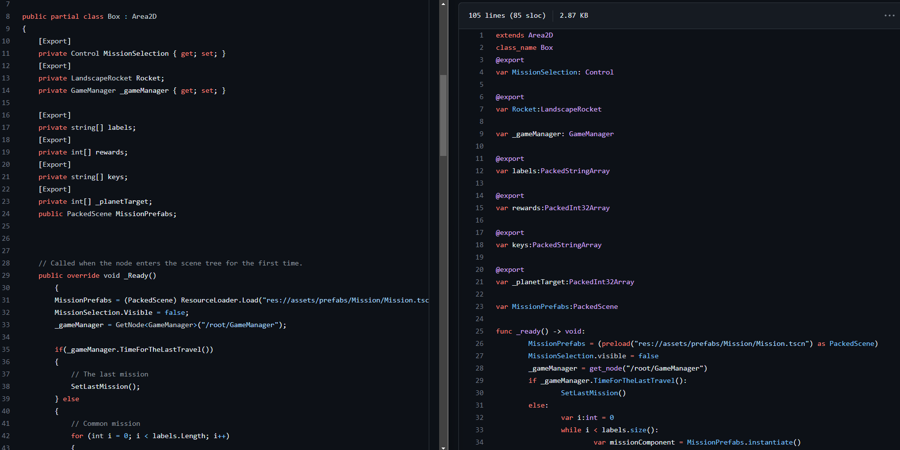

This is a project to convert your Godot4 C# project to Godot4 gdscript.

# DISCLAIMER 
This was done entirely during the game jam (ludum dare 53) so it might not work for you if you try it, but feel free to open issues or PR I’d gladly make this a viable solution if users need it.

# The story
 We did originally chose to try godot for the first time so we started with Godot4.0.2 We wanted to build as a web game as we know more users would try our game and it avoided us to compile the game for every platform.

In the middle of the jam we decided to build to check everything was alright, and POM POM POM… We discovered that using C# for Web with Godot4.0 is not yet available, at this moment we were really disappointed and then came the idea of rewritting the code we had to GDScript (we did not have much code to convert, like 470lines of C# at the moment).

The other idea that came was, why not looking if there exist a tool to automate that ? We did note found anything usable, then we thought, well, why not write it ourselves ? That’s how we decided to create a transpiler to transform C# to GDScript. Hopefully both languages are really close semantically, also their typing system works almost the same. The thing works and is opensourced so give it a shot and do PR and post issues !

Our game is currently built with the following process : Godot4.0 C# → CSToGDScript → Godot4.0 GDScript → Web 😀
